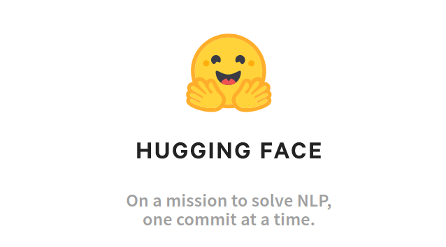

# Solution Description

In this project, I had one day to develop an NN model to perform binary classification of text (Twitter posts), categorizing them as either having a positive or negative sentiment. Additionally, I was tasked with comparing my resulting solution with the pre-trained Zero-shot BART model (as demonstrated in bart-example.ipynb). Given the time constraints and the lack of access to GPUs, I decided to implement a simple Feed Forward Neural Network using PyTorch and train/validate it using the small dataset available in the repository.
Although I did not have enough time to attain the highest possible accuracy through fine-tuning or the usage of compute-heavy architectures, my simple solution achieved a classification accuracy of around 77%, thus outperforming the BART baseline which had an accuracy of 70%. The train and validation curves suggested that the model is underfitting the data and thus a scale-up of the model and the dataset would certainly improve performance further.

# Architecture

The solution is a Feed Forward Network with 1 fully-connected layer and a ReLU activation, a drop-out layer for regularization, followed by a final fully connected layer and a sigmoid activation function to a single neuron that predicts the binary class of the sample.

The BCE Loss function was used and both the Adam and SGD Optimizer were experimented with.

## Technology and methodology
The most important technologies and ML techniques used in this use-case include:

- Using __pandas__ and __ProfileReports__ for data exploration.
- Using __Pytorch__ Datasets together with a Tensorflow Universal sentence encoder to preprocess the raw data into NN-suitable tensors.
- Using __Weights and Biases__: a web-based dashboard to monitor the training of Deep Leaning models and tracking of experiments.
- The usage of a __validation set__ and __early stopping__ Regularization techniques such as a __Dropout__ layer to prevent over-fitting.

## How to navigate the repo and run code
- __Pytorch__ code can be found under the directory scripts:
    - __TwitterDataset.py__ encodes the raw data and processed it into Tensor datasets.
    - __BinaryFFNN.py__ contains the architecture of the model.
    - ___BinaryFFNN_train.py__ contains the code that trains the model.
- __data_exploraion__ notebook contains the data exploration made in pandas.
- __model_comparisoon__ notebook compares the BART baseline with my proposed solution.
- __models__ directory stores the trained models.

## What I would have done If I had more time
I had many more ideas to try out for this use case, but did not have time to do so given the time constraint. I would be happy to discuss them later during the interview but a few ideas that remain on my TODO list include:
- Perform some feature extraction on the original dataset such as: month, weekday, time of day of the tweet, or even userid (as it might be indicative of user age) to add more features to the classifier.
- Improve the training loop by employing k-folds cross validation.
- Move on to more advanced architectures that leverage the 1d spacial relation of tokens, such as 1d Convolutional NNs, or Recurrent NNs.

# NLP modeling case

## Description

The task is to use a version of the Twitter sentiment dataset (You can download dataset through the link: [The dataset](https://drive.google.com/file/d/13mAaFqCrscUYkoITf4rZ6qG9ptAlIJVb/view?usp=sharing)) and create a simple but complete preprocessing, training and validation pipeline to predict the target *is_optimistic*. 
Further, you're tasked to compare your results with those of a pre-trained Zero-shot approach such as Bart [Bart info](https://huggingface.co/transformers/model_doc/bart.html).

The repository contains a small version of the dataset (20K examples) with an added column "bart_is_optimistic" which is the output of the Bart-model (for a query "this text is" [optimistic]). An example of how this is done is included in the notebook 'bart-example.ipynb'. You are free to base your whole training and analysis on this small version of the dataset if you have no access to a GPU (the inference with Bart is slow on CPU). 

### To summarize 

One part of the coding task is to predict the target using a supervised method (eg. encoding it with a Universal sentence encoder or some other method and feeding into a neural network). Second part of the coding task is to use the output of the zero-shot approach (Bart model) to perform an inference on same texts, and to compare the results of the two models. To help you out a bit, we provide predictions for this step in the smaller version of the dataset. 

## Tasks

1. Read the paper [BART: Denoising Sequence-to-Sequence Pre-training for Natural Language Generation, Translation, and Comprehension](https://arxiv.org/abs/1910.13461) and get a high-level understanding of the architecture, how the dataset was created and how the data was encoded. Be prepared to discuss it briefly during the interview.

2. Load the dataset (small or full version). 

3. Perform preprocessing and cleaning steps of your choice (the text column is named *message*).

4. Train a model (Choose a method/architecture you find suitable).

5. Validate the model performance with regard to predictive performance and generalizability. You’re free to choose metrics you find relevant for this particular task.

6. Make additional predictions using the Bart model (or use the small dataset with the predictions already done) and validate the results (and compare to the results of the model you've trained in the previous step.

7. Present code, descriptive analysis and model performance (For instance in a Jupyter notebook).

## Finally

If time is short or you get stuck, do as much as you can, and be prepare to explain the steps you omitted. 
This is an open-ended case, and you are encoraged to solve it the way you think is suitable. Some statements are vague (such as "compare" the models), and in those cases you're free to make your own interpretations and assumtions. 

