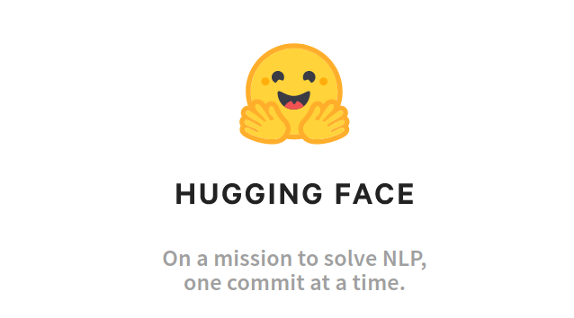

# NLP modeling case

## Description

The task is to use a version of the Twitter sentiment dataset (You can download dataset through the link: [The dataset](https://drive.google.com/file/d/1DnClwbF4OUPS_DCJHJqWmJsNARS8Rfkl/view?usp=sharing)) and create a simple but complete preprocessing, training and validation pipeline to predict the target *is_optimistic*. 
Further, you're encouraged to compare your results with those of a pre-trained Zero-shot approach such as Bart.

The repository contains a small version of the dataset (20K examples) with an added column "bart_is_optimistic" which is the output of the Bart-model (for a query "this text is" [optimistic]). An example of how this is done is included in the notebook 'bart-example.ipynb'. You are free to base your whole training and analysis on this small version of the dataset if you have no access to a GPU (the inference with Bart is slow on CPU). 

### To summarize 

One part of the coding task is to predict the target using a supervised method (eg. encoding it with a Universal sentence encoder or some other method and feeding into a neural network). Second part of the coding task is to use the output of the zero-shot approach (Bart model) to perform an inference on same texts, and to compare the results of the two models. To help you out a bit, we provide predictions for this step in the smaller version of the dataset. 

## Tasks

1. Read the paper [BART: Denoising Sequence-to-Sequence Pre-training for Natural Language Generation, Translation, and Comprehension](https://arxiv.org/abs/1910.13461) and get a high-level understanding of the architecture, how the dataset was created and how the data was encoded. Be prepared to discuss it briefly during the interview.

2. Load the dataset (small or full version). 

3. Perform preprocessing and cleaning steps of your choice (the text column is named *message*).

4. Train a model (Choose a method/architecture you find suitable).

5. Validate the model performance with regard to predictive performance and generalizability. You’re free to choose metrics you find relevant for this particular task.

6. Present code, descriptive analysis and model performance (For instance in a Jupyter notebook).

7. Make additional predictions using the Bart model (or use the small dataset with the predictions already done) and validate the results (and compare to the results of the model you've trained in the previous step.

